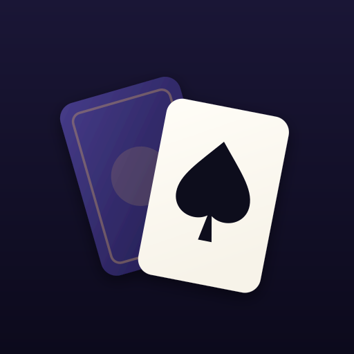

# Facedown

**A solitaire roguelite. Turn every card.**

Facedown is a mobile-first single-player card game. Each level deals your whole
deck into a tableau and a draw pile, and asks one thing: get every card face-up
in a column. There are no
foundation piles — nothing ever leaves the board. Between levels you enchant,
add and cut cards, buy charms, and choose which set of broken rules to take on
next. Your score is how deep you got.

<p align="center">
  
</p>

## The idea

Klondike ends when the foundations are full. Facedown removes the foundations
entirely, so the tableau is the whole game and the only goal is excavation. That
alone would lock up constantly, so the game adds two things:

- **A draw pile.** Turning a card off it costs a move, and a card sitting on the
  waste is seen but not sorted — it still has to be played into a column, so
  dealing the pile out is not progress. Play what you draw while you can; the
  next draw buries it. Once the pile runs dry you can turn the waste back over,
  twice.
- **A move allowance.** Every level gives you a fixed number of moves. Spend them
  all and the run is over. Moves, not luck, are the resource you manage.

Every deal is verified before you see it: a solver plays the board first, and the
allowance you get is derived from the length of the line it actually found. Every
board you are given is clearable. The question is whether you find the line — and
that line is shown to you as par, so you always know how close you are running.

There is a two-minute guided board the first time you open the game: fourteen
cards and five lessons, each arriving at the moment it is needed.

## Playing

| Action | How |
| --- | --- |
| Pick up a card | Tap it. Legal destinations light up. |
| Place it | Tap a highlighted card or column. |
| Send it somewhere sensible | Tap the same card again. |
| Precise placement | Drag it. |
| Turn the next card | Tap the draw pile. |
| Inspect a card | Press and hold. |

Stacks build down in alternating colours — 7♥ onto 8♠ — and a correctly ordered
run moves as one unit for one move. Uncovering a face-down card turns it. The
counter at the top is what is left to place, not what is left to turn.

## The run

- The run is a **queue you can read ahead**. You see the next three stages and
  their rules, and the Warden at the end of the stretch from the moment it
  starts — so you can build towards it.
- Any stage but the first and the Wardens can be **walked past**. It pays
  nothing at the time — you forfeit the spoils and the score, and the escalation
  carries on without you — but the market will set something aside for you *if
  you clear a board afterwards*. Skipping is a wager on your own survival.
- Clearing a level lets you **enchant a card**, add one, cut one, take a
  **charm**, widen the reserve, or bank gold.
- Every third level the **market** opens.
- **Your deck is the board.** Thinning it makes levels short and brittle; growing
  it gives you more cards carrying more power. There is no right answer.

Twelve card enchantments, four curses, fifteen charms and twenty-two level rules
combine into the difficulty; the in-game **Codex** documents all of them.

Because every board is solved before it is dealt, the game can be *asked
things*. The **Oracle** answers three questions — am I still winning, what
should I play, where did I go wrong — paid for in Insight, which is its own
currency and which you earn by clearing boards under par. The last of those
will offer to step you back to the last position that was still winnable.

When a run ends, the solver replays it and tells you where the line actually
closed, how many moves short you finished, and which enchantment would have
covered the gap.

Twenty achievements, lifetime statistics and the last twenty-five runs — with
their seeds, so a good one can be played again — live behind **Records** on the
title screen.

## Running it

```bash
npm install
npm run dev        # http://localhost:5173
npm run build      # -> dist/
npm run preview
```

```bash
npm test           # rules engine + run generation + a simulated 10-level run
npm run typecheck
npm run qa         # drives a real run in a mobile browser, fails on any page error
npm run balance    # difficulty telemetry: par vs. allowance by depth
npm run screenshots  # store screenshots at every required device size
```

### iOS and Android

The web build is wrapped with [Capacitor](https://capacitorjs.com). Both native
projects are committed and configured (portrait lock, dark status bar, splash
screen, haptics, generated icons for every density).

```bash
npm run sync                 # build the web app and copy it into both platforms
npx cap open ios             # opens Xcode  — requires macOS
npx cap open android         # opens Android Studio
```

The game is entirely offline: no accounts, no network calls at runtime, no
analytics, no ads. Progress lives in `localStorage` on the device. `ITSAppUsesNonExemptEncryption`
is already declared false, and the only Android permission is the one Capacitor
needs to serve its own local assets.

### As a PWA

`npm run build` emits a service worker that precaches the exact build output, so
after one load the game works with no network at all. The manifest is configured
for a standalone, portrait, installable app.

## How it is put together

```
src/game/     the rules engine, the solver, level generation, the run
src/ui/       board rendering, input, screens
src/worker/   dealing and hints, off the main thread
src/app.ts    the controller that ties them together
```

- **`sim.ts` is the single source of truth for the rules.** The playable game and
  the solver run the same code, so a board the solver certifies is winnable under
  exactly the rules the player is given.
- **`solver.ts` is a weighted A\*** over that engine. It certifies deals, sizes the
  move allowance, and powers the Hint button.
- **Rules changes are measured, not assumed.** Removing the foundations, and
  later the reserve, both risked making boards unwinnable; each was settled by
  exhaustively searching raw boards before it shipped. See `docs/DESIGN.md` §1.
- **Everything is seeded.** A run is a 32-bit seed plus a depth; a save is a small
  JSON blob, and an interrupted level is restored by replaying its moves.
- **No framework and no runtime dependencies.** Around 30 kB of gzipped
  JavaScript, all sounds synthesised at runtime, all art drawn in CSS and SVG.

`docs/DESIGN.md` covers the design reasoning and the balance model in more
detail. `docs/store/` holds the listing copy, the privacy policy and an ordered
release runbook for both stores.

## Licence

Not yet licensed for redistribution.
